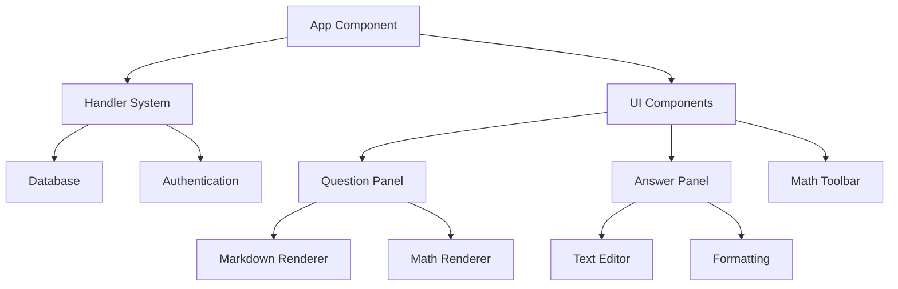

# System Patterns: Assignment Submission Handler

## Architecture Overview

The Assignment Submission Handler is built as a Next.js application with a split-pane interface for viewing and submitting assignments. It uses server-side rendering for initial content and client-side interactivity for the submission interface.

## Key Components

### Server Components

1. **Handler System**

   - Task fetching from database
   - Session management
   - Cookie handling
   - Error handling

2. **Database Integration**
   - Serverless database connection
   - Query execution
   - Result processing
   - Error handling

### Client Components

1. **UI Layout**

   - Split-pane interface
   - Resizable panels
   - Content rendering
   - Responsive design

2. **Content Management**
   - Markdown rendering
   - LaTeX math support
   - Text formatting
   - File-like interface

## Design Patterns

### Server-Side Patterns

1. **Handler Implementation**

   ```typescript
   export async function handler() {
   	try {
   		const assignmentId = await getCookie("assignment_id");
   		const username = await getCookie("session");
   		// Handle authentication and task fetching
   	} catch (error) {
   		// Error handling
   	}
   }
   ```

2. **Database Operations**
   ```typescript
   async function fetchTask(assignmentId: string, sanitizedTableName: string) {
   	const query = `SELECT "task","work" FROM "User Infomation"."${sanitizedTableName}" WHERE "assignment_id" = $1`;
   	const data = await sql(query, [assignmentId]);
   	return data;
   }
   ```

### Client-Side Patterns

1. **UI Components**

   - Split-pane layout
   - Resizable panels
   - Content rendering
   - Responsive design

2. **State Management**
   - Panel width state
   - Content state
   - UI state (toolbars, etc.)
   - Responsive adjustments

## Technical Decisions

### Next.js Integration

- App Router structure
- Server components for data fetching
- Client components for interactivity
- API route handling

### Database Integration

- Serverless database
- Prepared statements
- Error handling
- Session management

### UI Framework

- React components
- CSS modules
- Responsive design
- Split-pane layout

## Component Relationships


