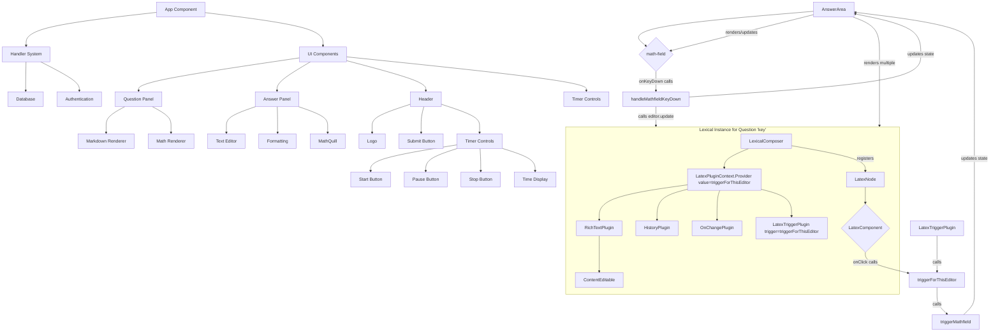

# System Patterns: Assignment Submission Handler

## Architecture Overview

The Assignment Submission Handler is built as a Next.js application using the App Router. It features a split-pane interface for viewing assignments (rendered server-side with Markdown/KaTeX) and submitting work via a client-side Lexical editor (`AnswerArea.tsx`) enhanced with MathLive for LaTeX input.

## Key Components

### Server Components

1. **Handler System**

   - Task fetching from database
   - Session management
   - Cookie handling
   - Error handling

2. **Database Integration**
   - Serverless database connection (Neon)
   - Query execution
   - Result processing
   - Error handling

### Client Components

1. **UI Layout (`lambai.tsx`, `AnswerArea.tsx`)**

   - Split-pane interface
   - Resizable panels
   - Responsive design
   - Modern header
   - Timer controls

2. **Content Management & Editing (`AnswerArea.tsx`, `editor/`)**

   - Lexical editor instance per question.
   - `RichTextPlugin` for basic text editing.
   - Custom `LatexNode` to represent inline LaTeX.
   - `LatexComponent` renders `LatexNode` using `react-katex` (for display within editor).
   - External MathLive (`<math-field>`) web component for LaTeX input/editing.
   - `LatexTriggerPlugin` detects `!!` to initiate new LaTeX node insertion via MathLive.
   - `LatexPluginContext` provides `triggerMathfield` function to bridge communication between `LatexComponent`/`LatexTriggerPlugin` and `AnswerArea`'s MathLive state.
   - `lexicalStateToAnswerBlocks` converts editor state to structured data.

3. **Timer System (within `lambai.tsx`)**
   - Start/Pause/Stop controls
   - Time display
   - State management (`useState`, `useRef`)

## Design Patterns

### Server-Side Patterns

1. **Handler Implementation**

   ```typescript
   export async function handler() {
   	try {
   		const assignmentId = await getCookie("assignment_id");
   		const username = await getCookie("session");
   		// Handle authentication and task fetching
   	} catch (error) {
   		// Error handling
   	}
   }
   ```

2. **Database Operations**
   ```typescript
   async function fetchTask(assignmentId: string, sanitizedTableName: string) {
   	const query = `SELECT "task","work" FROM "User Infomation"."${sanitizedTableName}" WHERE "assignment_id" = $1`;
   	const data = await sql(query, [assignmentId]);
   	return data;
   }
   ```

### Client-Side Patterns

1. **Lexical Editor Configuration (`AnswerArea.tsx`)**

   - `LexicalComposer` wraps each editor instance.
   - `initialConfig` registers custom nodes (`LatexNode`) and theme.
   - Plugins (`RichTextPlugin`, `HistoryPlugin`, `OnChangePlugin`, `LatexTriggerPlugin`) provide functionality.
   - Context (`LatexPluginContext`) used for cross-component communication related to triggering the external MathLive editor.

2. **External UI Interaction (MathLive)**

   - An external UI component (`<math-field>`) is controlled by React state (`isLatexInputVisible`, `currentLatexValue`).
   - Interactions within Lexical (clicks on `LatexComponent`, typing `!!` detected by `LatexTriggerPlugin`) call `triggerMathfield`.
   - `triggerMathfield` updates state to show and populate the MathLive input.
   - Submitting the MathLive input (`handleMathfieldKeyDown`) uses `editor.update()` to modify the Lexical state (`setLatex` on existing node or `$createLatexNode`/`insertNodes` for new node).

3. **State Management**

   - Local state (`useState`) within `AnswerArea.tsx` manages MathLive visibility, content, and target node.
   - `useRef` stores editor instances (`editorRefMap`) for targeted updates.
   - `useCallback` optimizes event handlers.
   - `OnChangePlugin` with debouncing (implicitly via `onAnswersChange` prop?) updates parent component.

4. **Custom Lexical Nodes (`LatexNode.tsx`)**
   - Extends `DecoratorNode`.
   - `decorate` method renders the React component (`LatexComponent`) for display.
   - `importJSON`, `exportJSON` for serialization.
   - `createDOM`, `updateDOM` for basic DOM structure.
   - Custom methods like `setLatex`.

## Technical Decisions

### Next.js Integration

- App Router structure
- Server components for data fetching
- Client components for interactivity
- API route handling

### Database Integration

- Serverless database
- Prepared statements
- Error handling
- Session management
- Time tracking

### UI Framework

- React components
- CSS modules
- Responsive design
- Split-pane layout
- FontAwesome icons
- Modern styling

### Editor: Lexical

- Lexical chosen for its extensibility.

### LaTeX Rendering (Display): `react-katex`

- Used within `LatexComponent` for inline display in the editor.

### LaTeX Input/Editing: MathLive

- MathLive (`<math-field>`) used externally for a dedicated, powerful math input experience.

### Interaction Bridge: React Context

- React Context (`LatexPluginContext`) and state management in `AnswerArea.tsx` connect Lexical interactions to the external MathLive component.

## Component Relationships


